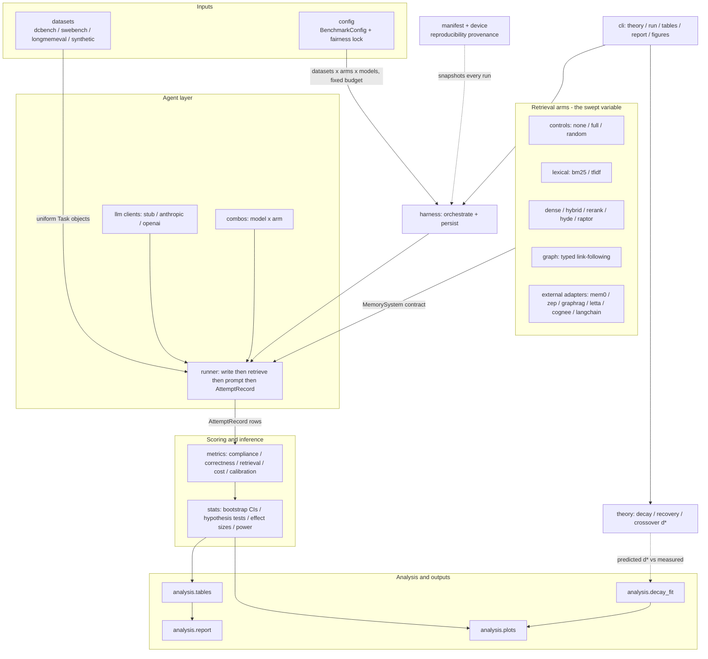
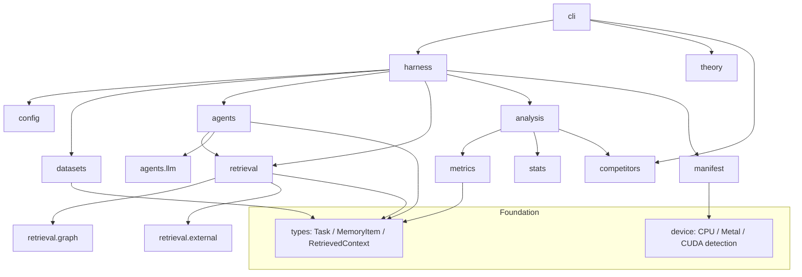

# Architecture

This document describes the architecture of `membench` (a.k.a. BriefBench), the
reference implementation for the paper *Depth, Not Length*. It is meant for
contributors: how the pipeline is wired, what each subpackage is responsible for,
why the benchmark runs offline and deterministically by default, and what the
polyglot acceleration and validation directories are for.

The package source lives under [`../src/membench/`](../src/membench/). Companion
methodology and validation notes are in
[`METHODOLOGY.md`](./METHODOLOGY.md), [`VALIDATION.md`](./VALIDATION.md),
[`THREATS.md`](./THREATS.md), and [`HARDWARE.md`](./HARDWARE.md).

## The one-sentence design

The benchmark holds *everything* fixed — model, code-search tool, per-dataset token
budget — and sweeps a single variable: the **memory arm**. Every arm conforms to one
small contract (`write` a corpus, then `retrieve(query, budget_tokens)`), every
dataset emits one uniform `Task` shape, and scoring happens *after* execution over a
single canonical record. That uniformity is what lets the harness be a flat loop
over `tasks × arms × models`, and it is what makes the comparison fair.

## Pipeline overview

The end-to-end flow, from raw datasets to the rendered report and figures:

The driver is [`harness.py`](../src/membench/harness.py): it loads a dataset's
tasks, runs each arm against the model under the fixed budget, scores every attempt,
and persists the canonical scored rows to JSONL so the `tables` / `report` /
`figures` commands can consume a finished run. The [`cli.py`](../src/membench/cli.py)
exposes five commands — `theory`, `run`, `tables`, `report`, `figures` — and runs
offline by default.

## Subpackage component diagram

Dependencies between the package's modules and subpackages (arrows point from
dependent to dependency):

## Subpackage responsibilities

Read alongside the modules themselves — every module carries a docstring that states
its contract.

### `types` — the core contracts
[`types.py`](../src/membench/types.py) defines the small, immutable value objects
that flow through the entire pipeline: `MemoryItem` (one unit a memory system
ingests, carrying the stable `item_id` join key), `RetrievedContext` (the assembled
context string *plus* the ordered ids of the items that composed it — never
discarded, because retrieval quality is scored against them), `Task` (one evaluation
unit, identical in shape across every dataset), plus `Scorer` and `SpecVariant`.
These are frozen dataclasses, so a corpus written for one task can never be mutated
by an arm and leak into another.

### `theory` — the analytical core
[`theory/`](../src/membench/theory/) holds the closed-form models the empirics are
compared against: the geometric similarity-decay law (`decay.py`, `s_i = s_0·ρ^i`),
the full-chain recovery bounds for similarity vs. structured memory (`recovery.py`),
the crossover-depth solver that locates `d⋆` once the structured store is charged its
honest overhead (`crossover.py`), the information-theoretic framing
(`information.py`), and the fitting utilities (`fit.py`) that tie predicted `d⋆` to
the empirically observed crossover.

### `retrieval` — the memory arms (the swept variable)
[`retrieval/`](../src/membench/retrieval/) is the set of swappable memory systems.
The [`base.py`](../src/membench/retrieval/base.py) module defines the `MemorySystem`
contract, the `ArmRegistry` (recording each arm's family and capabilities —
link-following, embeddings, network), and `pack_to_budget`, the *single* truncation
rule every arm shares so the token budget stays a fair constraint. Arms self-register
on import via [`builtin.py`](../src/membench/retrieval/builtin.py). Families:

- **Controls** — `controls.py` (none / full-context / random).
- **Lexical similarity** — `bm25.py`, `tfidf.py`, with shared text utilities in
  `_text.py`.
- **Dense / hybrid neural** — `dense.py`, `hybrid.py` (RRF), `rerank.py`
  (cross-encoder), `hyde.py`, `raptor.py` (hierarchical), backed by `embeddings.py`.
- **Embeddings** — [`embeddings.py`](../src/membench/retrieval/embeddings.py)
  provides the deterministic feature-hashing default and the optional neural
  backends, all behind one `EmbeddingProvider` interface.
- **Native kernel bridge** — `_native.py` loads the optional compiled cosine-top-k
  kernel via ctypes with a NumPy reference fallback (see *Polyglot directories*).

#### `retrieval.graph` — the structured store
[`retrieval/graph/`](../src/membench/retrieval/graph/) is the benchmark's positive
claim: a memory that *follows explicit typed links* rather than ranking by
resemblance. `store.py` mirrors Brief's data model (a node registry plus a typed,
confidence-weighted, usage-tracked edge table), `traversal.py` reproduces bounded
multi-hop BFS, `decay.py` implements usage-aware confidence decay, `arm.py` exposes
it as a `MemorySystem`, and `live.py` is the arm that queries a real, pre-seeded
Brief workspace.

#### `retrieval.external` — third-party competitors
[`retrieval/external/`](../src/membench/retrieval/external/) wraps real external
memory systems — Mem0, Zep/Graphiti, GraphRAG, Letta, Cognee, LangChain — behind the
same `MemorySystem` contract so each competes on identical tasks, budget, and model.
Each adapter lazy-imports its backend (the packages pin mutually-incompatible
dependencies and are not in the lockfile) and accepts an injected client for testing.
These are *measured* (Tier-1) competitors; vendors' *published* numbers are kept
separately (see `competitors`).

### `agents` — the agent loop and LLM clients
[`agents/`](../src/membench/agents/) wires a memory arm to a model. `runner.py` is
deliberately metrics-free: it writes the corpus, retrieves under the fixed budget,
prompts the model, and records the raw outcome (retrieved ids + gold governing
decisions) as an `AttemptRecord`; scoring happens afterward. `combos.py` defines the
model × memory pairings the benchmark compares.
[`agents/llm/`](../src/membench/agents/llm/) holds the client abstraction (`base.py`)
with per-call token and dollar accounting, real `anthropic_client.py` and
`openai_client.py` backends, a `pricing.py` table, and the deterministic
`stub.py` — the stub "honours" exactly the decisions whose identifiers appear in the
retrieved context, so the accuracy and token-cost story fall out of real retrieval
differences with no API calls.

### `datasets` — task loaders
[`datasets/`](../src/membench/datasets/) emits the uniform `Task` shape from every
source: `dcbench.py`, `swebench.py`, `longmemeval.py`, the controllable synthetic
depth-`d` chain generator (`synthetic.py`), the spec-stripping / depth-dialing
harness shared by the coding datasets (`base.py`), and the depth-labelling protocol
(`depth_labeling.py`).

### `metrics` — measurement
[`metrics/`](../src/membench/metrics/) turns a model response into measured
quantities and never decides control flow: `compliance.py` (decision compliance),
`correctness.py` (merge-ready correctness), `retrieval.py` (precision/recall@k, MRR,
nDCG, MAP, full-chain recovery), `cost.py` (cost-to-correct in tokens and dollars,
useful-signal `U = tokens × precision`), and `calibration.py`.

### `stats` — inference
[`stats/`](../src/membench/stats/) provides the statistical machinery so every
headline number ships with an interval and a test: `bootstrap.py` (confidence
intervals), `hypothesis.py` (paired Wilcoxon / permutation), `multiple_comparisons.py`
(Holm / Bonferroni, Friedman + Nemenyi), `effect_size.py` (Cliff's delta, Cohen's
d), `regression.py` and `mediation.py`, `bayes.py`, `dominance.py`, `changepoint.py`,
`model_selection.py` (AIC/BIC), and `power.py`.

### `analysis` — aggregation, tables, figures, report
[`analysis/`](../src/membench/analysis/) aggregates over the one canonical row
schema: `tables.py` (the headline tables and scoring helpers), `report.py` (the full
report), `plots.py` (publication figures), and `decay_fit.py` (fits the empirical
decay law and compares it to the theory's predicted `d⋆`).

### `config` — typed run spec and the fairness lock
[`config/`](../src/membench/config/) holds the pydantic `BenchmarkConfig`
([`schema.py`](../src/membench/config/schema.py)). It enforces the *fairness lock*
structurally: the token budget is keyed by dataset (never by arm), so every arm
provably sees the same budget for a given dataset, and the validator rejects a config
that omits a budget for a swept dataset or leaves arms/models empty.

### `competitors` — provenance tiers
[`competitors.py`](../src/membench/competitors.py) separates two tiers and refuses to
mix them: **Tier 1 (measured)** — produced by this harness under identical
conditions; **Tier 2 (vendor-reported)** — numbers a competitor published under its
own conditions, kept in clearly labelled columns with a citation. It loads and
validates the Tier-2 registry and provides the guard the analysis layer uses.

### `cli`, `harness`, `device`, `manifest` — orchestration & provenance
- [`cli.py`](../src/membench/cli.py) — the `membench` command-line interface (five
  commands; offline by default).
- [`harness.py`](../src/membench/harness.py) — end-to-end orchestration: load
  datasets × arms × model, score, and persist the canonical rows.
- [`device.py`](../src/membench/device.py) — best-effort compute-device detection
  (CPU / Apple Metal / NVIDIA CUDA) recorded for honest run provenance; it only
  *labels* the environment, it never changes where work runs.
- [`manifest.py`](../src/membench/manifest.py) — the reproducibility manifest:
  snapshots package version, Python/platform identity, detected device, resolved
  config, tracked dependency versions, and the git commit, so a run can be
  reconstructed and audited.

## Offline-by-default design

The benchmark is designed to run with **no network and no API key**, deterministically:

1. **Stub model.** The default [`StubLLMClient`](../src/membench/agents/llm/stub.py)
   honours exactly the decision identifiers present in the retrieved context, so
   compliance is driven by *real* retrieval quality and cost by *real* prompt size —
   the accuracy and token-economics results fall out without any API calls. It is
   still priced as the real model, so token-cost differences remain meaningful.
2. **Hashing embeddings.** The default
   [`HashingEmbeddingProvider`](../src/membench/retrieval/embeddings.py) turns text
   into vectors with the deterministic hashing trick (hashing via `hashlib`, never
   Python's salted `hash`), so cosine similarity reflects lexical overlap and is
   reproducible across processes. It is a faithful stand-in for "rank by surface
   resemblance" — exactly the mechanism the similarity arms embody.

Real neural embedding backends, real Anthropic/OpenAI clients, and the external
competitor adapters all sit behind optional extras and conform to the same
interfaces, so an arm never knows which backend it is using. See
[`METHODOLOGY.md`](./METHODOLOGY.md) for why this makes the result a property of the
mechanism rather than of any particular model.

## Polyglot acceleration and validation directories

The Python/NumPy reference pipeline is **authoritative** and produces every reported
number. The non-Python directories exist either to *accelerate* large sweeps or to
*differentially validate* the Python implementation in another language. None is
required to reproduce the results.

### Acceleration — optional, parity-checked
The same cosine-top-k operation is implemented in three native flavours, each
mirroring the NumPy reference in
[`retrieval/_native.py`](../src/membench/retrieval/_native.py) and validated against
it byte-for-byte; when absent, the Python layer transparently falls back to NumPy:

- [`native/c/`](../native/c/) — a C/SIMD shared object (`membench_native.c` + header
  + `Makefile`), loaded via ctypes.
- [`crates/membench-kernels/`](../crates/membench-kernels/) — a Rust kernel
  (`src/lib.rs`) exposed to Python via PyO3.
- [`cuda/`](../cuda/) — an optional NVIDIA GPU kernel (`cosine_topk.cu`); the CPU/Metal
  path is used elsewhere (see [`HARDWARE.md`](./HARDWARE.md)).
- [`orchestrator/`](../orchestrator/) — a Go program (`main.go`) that shards a sweep
  across CPU cores/hosts by shelling out to the Python CLI (the single source of
  truth), adding parallelism without duplicating benchmark logic.

### Validation — independent cross-language references
[`reference/`](../reference/) holds independent re-implementations used to
differentially test the Python scorers and stats — if the two disagree on the same
inputs, the test fails:

- `reference/java-bm25/` — a Java BM25 cross-check of the lexical scorer.
- `reference/csharp-ndcg/` — a C# nDCG re-implementation cross-checking
  `metrics.retrieval.ndcg_at_k`.
- `reference/r/critical_difference.R` — an R cross-check of the Friedman + Nemenyi
  critical-difference analysis (`stats.multiple_comparisons`), in the language
  Demšar's protocol is canonically run in.

### Schema and seeding
- [`schema/graph.sql`](../schema/graph.sql) — portable reference DDL for Brief's
  typed-node + typed-edge context-graph model that the structured arm reproduces in
  memory (validated with sqlite3 in CI; Postgres/pgvector specifics noted in
  comments).
- [`tools/seed/`](../tools/seed/) — a small TypeScript tool that seeds a real Brief
  workspace with the dcbench decisions ahead of a run, for the `brief_live` arm.

## Where the data lives

Committed, repo-measured results live under [`../results/`](../results/) — the
canonical rows in [`results/data/`](../results/data/) and human-readable summaries in
[`results/METRICS.md`](../results/METRICS.md),
[`results/EVALS.md`](../results/EVALS.md), and
[`results/FIGURES.md`](../results/FIGURES.md). Per-run measured artifacts are under
[`../paper/measured/`](../paper/measured/). This document deliberately does not
restate any benchmark figures; consult those sources, which carry the provenance
(measured vs. vendor-reported) with each number.
